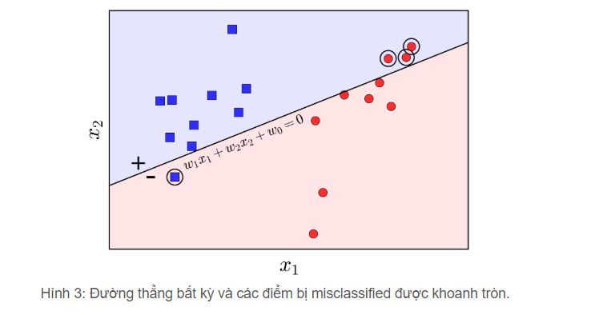

# Linear regression
Bài viết dựa trên [ML blog](https://machinelearningcoban.com/2016/12/28/linearregression/)
## 1. Giới thiệu.  
Bài toán:  
> Cho 1 căn nhà rộng $x_1 m^2$, có $x_2$ phòng ngủ và cách trung tâm thành phố $x_3 km$ có giá bao nhiêu? Biết rằng chúng ta đã có số liệu thống kê từ 1000 căn nhà trong thành phố đó, liệu rằng khi 1 có 1 căn nhà mới với các thông số trên, ta có thể dự đoán được không?.  

Ta sẽ dự đoán hàm y = f(x) với **x**$=[x_1, x_2, x_3]$  
**Lưu ý:**  
- Các số vô hướng sẽ được biểu diễn bởi các chữ cái không in đậm, vd: x1, N, y, k.  
- Ma trận là các chữ cái viết hoa in đậm: **X**, **Y**, **Z**   
- vector được biểu diễn là các chữ cái thường in đậm: **y**, **x**.  
Ta thấy rằng có thể biểu diễn hàm f(**x**) dưới dạng 1 hàm tuyến tính.   

$$y \approx f(x) = \hat{y}$$  

$$f(x) = w_1x_1 + w_2x_2 + w_3*x_3 + w_0 (1)$$  
Trong đó $w_1, w_2, w_3$ được gọi là hằng số, $w_0$ được gọi là bias.  
Mối quan hệ $y \approx f(x)$ được gọi là mối quan hệ tuyến tính.  
Ta cần tối ưu ${w_1, w_2, w_3, w_0}$, đây được gọi là bài toán Linear Regression.  
## 2. Phân tích toán học  
### 2.1. Dạng của Linear Regression  
Ta chuyển đổi bài toán này này bài toán ma trận:  
Đặt:  
- **w** = $[w_0, w_1, w_2, w_3]^T$  
- **$\bar{x}$** = $[1, x_1, x_2, x_3]$.  
--> $y \approx \bar{x}w$.  
### 2.2. Lost function  
Ta muốn minimize sai số, hay nói cách khác là minimize lost function.  
$L(w) = \frac{1}{2} sum_{i=1}{N} (y_i - \bar{x}w)^2 = \frac{1}{2} ||y - \bar{x}w||^2$  
Với ||z|| là Euclidean norm(chuẩn Euclid, hay khoảng cách Euclid) hay nói cách khác $||z||^2$ là tổng bình phương của các phần tử trong vector **z**.  
### 2.3. Nghiệm cho bài toán Linear Regression  
Cách phổ biến nhất để tìm nghiệm cho bài toán tối ưu là giải phương trình đạo hàm(gradient) = 0.  
Ta tính đạo hàm **w** của hàm mất mát.  
$\frac{\partial L(w)}{\partial w}=\bar{X}^T (\bar{X}w - y)$  
Từ đó ta có phương trình tuyến tính: $Aw = b$
Với $b = \bar{X}^T y$ và $A = \bar{X}^T \bar{X}$
Phương trình trên có nghiệm khi: ma trận $A = \bar{X}^T \bar{X}$ khả nghịch và $w = A^-1 b$.  
Nếu không có thì ta sẽ dùng khái niệm giả nghịch đạo A (dagger).  
## 3. Nhược điểm của Linear Regression.  
- Nó rất nhạy cảm với nhiễu.  
  
- Không biểu diễn được các mô hình phức tạp.  

# Perceptron Learning Algorithm  
## 1. Giới thiệu.  
- PLA là 1 thuật toán classification.  
- PLA là thuật toán cho trường hơn đơn giản nhất: chỉ có 2 class(lớp) (binary classification).  
Bài toán:
> Giả sử chúng ta có 2 tập hợp dữ liệu đã được gắn nhãn được minh họa trong hình 1 bên trái dưới đấy. Hai class của chúng ta là tập các điểm màu xanh và tập các điểm màu đỏ. Bài toán đặt ra là từ 2 tập dữ liệu, hãy xây dựng 1 classifier để khi có dữ liệu mới thì ta có thể đoán được nhãn của nó.  

Bài toán Perception:
> Cho 2 class được gắn nhãn, hãy tìm 1 đường phẳng sao cho toàn bộ các điểm thuộc class 1 nằm về 1 phía, toàn bộ các điểm thuộc class 2 nằm về phía còn lại.  

Nếu tồn tại 1 đường phẳng phân chia 2 class thì ta gọi 2 class đó là linearly separable. Các thuật toán classification tạo ra các boundary là các đường phẳng được gọi chung là Linear Classifier.  

  

## 2. Thuật toán Perceptron (PLA).  
Cũng giống nhưng các thuật toán lặp trong K-means clustering và Gradient Descent, ý tưởng cơ bản của PLA là xuất phát từ 1 nghiệm dự đoán nào đó, qua các vọng lặp, nghiệm sẽ được cập nhật tới 1 vị trí tốt hơn.  
**Một số kí hiệu**  
Giả sử $X = [x_1, x_2, ... x_N] \in R^{d*N}$ là ma trận chứa các điểm dữ liệu mà mỗi cột $x_i \in R^{d*1}$ là 1 điểm trong không gian d chiều.  
Giả sử thêm các nhãn tương ứng với từng điểm dữ liệu được lưu trong 1 vector hàng **y** = $[y_1, y_2, ... y_N] \in R^{1*N}$ với $y_i$ bằng 1 nếu $x_i$ thuộc class 1 và ngược lại.  
Tại 1 thời điểm, giả sử tìm được boundary là đường thẳng có phương trình.  
$f_w{x} = w_1x_1 + ... + w_dx_d + w_0 = w^{T}\hat{x} = 0$
Với $\hat{x}$ là điểm mở rộng bằng thêm phần tử $x_0 = 1$ lên trước vector x.  
Để đơn giản, chúng ta hãy làm việc với trường hợp mỗi điểm dữ liệu có số chiều d = 2. Giả sử đường thẳng $w_1x_1 +w_2x_2 + w_0 = 0$ chính là nghiệm cần tìm như Hình 2 dưới đấy.  

  

Nhận xét rằng các điểm nằm về cùng 1 phía so với đường thẳng này sẽ làm cho hàm $f_w(x)$ cùng dấu.  
Chỉ cần đổi dấu của **w** nếu cần thiết, ta có thể giả sử các điểm nằm trong nửa mặt phẳng nền xanh mang dấu (+), các điểm trong nửa mặt phẳng nền đỏ mang dấu âm (-).  
Các dấy này tương tự với nhãn y của mỗi class. Vậy nếu w là 1 nghiệm của bài toán Perception, với mỗi điểm dữ liệu mới x chưa được gắn nhãn, ta có thể xác định class của nó bằng phép toán đơn giản như sau:  

label(x) = 1 if $w^{T}x \geq 0$, otherwise -1 
Ngắn gọn hơn là:
label(x) = sgn($w^{T}x$)  
**Xây dựng hàm mất mát**  
Tiếp theo, chúng ta cần xây dựng hàm mất mát với tham số w bất kì. Vẫn trong không gian 2 chiều, giả sử đường thẳng $w_1x_1 +w_2x_2 + w_0 = 0$ được cho là hình 3 dưới đây.  

  

Ta có hàm mất mát:

$$J_1(w) = \sum_{x_i \in M} (-y_{i}sgn(w^{T}x_i))$$  
trong đó M là tập hợp các điểm bị misclassified (tập hợp này thay đổi theo **w**), vì điểm này bị misclassifed nên $y_i$ và $sgn(w^{T}x)$ khác nhau, vì thế $-y_{i}sgn(w^{T}x_i = 1$. Hàm $J_1$ có giá trị nhỏ nhất bằng 0.  
Tuy nhiên, đây lại là 1 hàm số rời gạc, không tính được đoạn hàm them w nên khó tối ưu. Chúng ta cần 1 hàm mất mát khác tối ưu hơn:  
Xét hàm mất mát sau:  

$$J(w) = \sum_{x_i \in M} (-y_{i}w^{T}x_i)$$  
Hàm J() khác 1 chút với hàm J_1() ở việc bỏ đi hàm sgn. Nhận xét rằng khi 1 điểm misclassified $x_i$ nằm càng xa boundary thì giá trị $-y_{i}w^{T}x_i$ sẽ càng lớn. Giá trị nhỏ nhất của hàm mất mát này cũng bằng 0 nếu không có điểm nào bị misclassified. Hàm mất mát này cũng được cho là tốt hơn hàm $J_1()$ vì nó trừng phạt rất nặng các điểm lấn sâu xác lãnh thổ của class kia. Trong khi đó $J_1()$ trừng phạt các điểm misclassifed như nhau (=1), bất kể chúng xa hay gần với đường biên giới.  
Tại 1 thời điểm, nếu chúng ta chỉ quan tâm tới các điểm bị misclassified thì hàm số J(w) khả vi (tính được đạo hàm), vậy chúng ta có thể sử dụng Gradient Descent và **Stochastic Gradient Descent(SGD)** để tối ưu hàm mất mát này. Với ưu điểm của SGD cho các bài toán large scale.  
**Note:** Trong thuật toán SGD, thay vì cập nhật tất cả đạo hàm của dữ liệu, ta chỉ đạo hàm $x_i$ rồi cập nhật $\theta$ dựa trên đạo hàm này. Việc này rất đơn giản nhưng thực tế lại hoạt động rất hiệu quả.  
Quay lại với bài toán.    
Với mỗi điểm dữ liệu x_i bị misclassified, hàm mất mát trở thành:  

$$J(w,x_i,y_i) = -y_{i}w^{T}x_i$$  

Đạo hàm tương ứng: = -y_{i}*y_{i}.  
Vậy quy tắc cập nhật là: $w = w + learning_rate*y_{i}x_i$.  
Nói cách khác, với mỗi điểm $x_i$ bị misclassifed, ta chỉ cần nhâm điểm đó với nhãm $y_i$ của nó, lấy kết quả cộng vào w ta sẽ được w mới.  
Đến đây, cảm nhận của chúng ta với thuật toán này là: cứ chọn đường boundary đi. Xét từng điểm 1, nếu điểm đó bị misclassified thì tiến đường boundary này về phía làm cho điểm đó đúng. Có thể thấy rằng, khi di chuyển đường boundary này, các điểm trước đó được classifed đúng cũng có thể bị misclassifed.  
Mặc dùn vậy, PLA vẫn được đảm bảo sẽ hội tụ sau 1 số hữu hạn bước, tức là cuối cùng, ta sẽ tìm được đường phẳng phân chia 2 lớp, miễn là 2 lớp đó linearly separable.  

